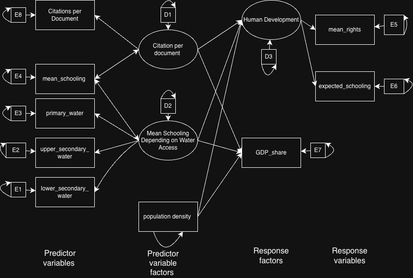

```{r setup, include=FALSE}
knitr::opts_chunk$set(echo = FALSE, warning = FALSE, message = FALSE)
```

## Data Loading and Preparation with Data Merging and Cleaning

We merged all datasets by country entity and cleaned the resulting dataframe to prepare for analysis.


```{r load-data}
knitr::opts_chunk$set(echo = FALSE, warning = FALSE, message = FALSE)

library(tidyverse)
library(dplyr)
library(jsonlite)
library(readxl)
library(psych)   
library(ggplot2)
library(corrplot)
library(GGally)
library(lavaan)
library(parameters)

# Load datasets from Our World in Data and other sources
df_1 = read.csv("https://ourworldindata.org/grapher/expected-years-of-schooling.csv?v=1&csvType=filtered&useColumnShortNames=true&mapSelect=CHN~NOR~SWE~FIN~CAN~USA~RUS~DEU~NLD~DNK~IRL~ISL~GBR~ESP~FRA~ITA~MEX~IND~BFA~MLI~DZA~TCD~ZAF~RWA~COD~PRY~BRA~PER~COL~AUS~NZL~PNG~PAK&overlay=download-data")

df_2 = read.csv("https://ourworldindata.org/grapher/average-years-of-schooling.csv?v=1&csvType=filtered&useColumnShortNames=true&mapSelect=CAN~USA~MEX~RUS~CHN~GBR~IRL~ISL~AND~ESP~FRA~DEU~DNK~NLD~ITA~BFA~RWA~COD~ZAF~SOM~TCD~DZA~MLI~AUS~PNG~NZL~BRA~PER~COL~NOR~FIN~SWE&overlay=download-data")

df_3 = read.csv("https://ourworldindata.org/grapher/total-government-expenditure-on-education-gdp.csv?v=1&csvType=filtered&useColumnShortNames=true&mapSelect=CAN~USA&overlay=download-data")

df_4 = read.csv("https://ourworldindata.org/grapher/schools-access-drinking-water.csv?v=1&csvType=full&useColumnShortNames=true")

df_5 = read.csv("https://ourworldindata.org/grapher/human-rights-index-vdem.csv?v=1&csvType=full&useColumnShortNames=true")

df_5 = df_5 %>%
  group_by(Entity) %>%
  mutate(mean_human_rights = mean(civ_libs_vdem__estimate_best, na.rm = TRUE))

df_6 = read.csv("world_population.csv")
df_6 = df_6 %>%
  rename(Entity = Country.Territory) 
df_6 = df_6[,c("Entity", "Density..per.km.." )]

df_7 = read_excel("publications.xlsx")
df_7 = df_7 %>%
  rename(Entity = Country) 
df_7 = df_7[,c("Entity","Citations per document")]

# Merge all datasets
df_8 = merge(df_1, df_2, all = TRUE)
df_9 = merge(df_3, df_4, all = TRUE)
df_10 = merge(df_5, df_6, all = TRUE)
df_11 = merge(df_7, df_8, all = TRUE)
df_12 = merge(df_9, df_10, all = TRUE)
df_13 = merge(df_11, df_12, all = TRUE)

# Aggregate by country and clean
final = df_13 %>%
  group_by(Entity) %>%
  summarise(across(everything(), ~ first(na.omit(.)))) %>%
  drop_na() %>%
  dplyr::select(-Code, -Year, -time.1, -time, -owid_region, -civ_libs_vdem__estimate_best)

# Rename variables for clarity
final = final %>%
  rename(expected_schooling = eys__sex_total, 
         mean_schooling = mys__sex_total, 
         GDP_share = combined_expenditure_share_gdp, 
         primary_water = X_4_a_1__se_acs_h2o__primary, 
         upper_secondary_water = X_4_a_1__se_acs_h2o__upper_secondary, 
         lower_secondary_water = X_4_a_1__se_acs_h2o__lower_secondary, 
         mean_rights = mean_human_rights, 
         density_per_km = Density..per.km..)

head(final)
```

## Descriptive Statistics

```{r descriptive-stats}
knitr::opts_chunk$set(echo = FALSE, warning = FALSE, message = FALSE)

numeric_final = final[,-c(1)]
describe(numeric_final)
```

## Univariate Visualizations

Based on the feedback from EDA, we changed our graphs to visualize each variable as a one-dimensional dot plot to better show the distribution of values across countries.

```{r univariate-plots, fig.height=10, fig.width=8}
knitr::opts_chunk$set(echo = FALSE, warning = FALSE, message = FALSE)

stripchart(final$`Citations per document`, method="jitter", jitter=0.3,
           pch=16, col="blue", xlab="Citations per Document", 
           main="Citations per Document", vertical=FALSE)

stripchart(final$expected_schooling, method="jitter", jitter=0.3,
           pch=16, col="blue", xlab="Expected Years of Schooling", 
           main="Expected Years of Schooling", vertical=FALSE)

stripchart(final$mean_schooling, method="jitter", jitter=0.3,
           pch=16, col="blue", xlab="Mean Years of Schooling", 
           main="Mean Years of Schooling", vertical=FALSE)

stripchart(final$GDP_share, method="jitter", jitter=0.3,
           pch=16, col="blue", xlab="GDP Share on Education (%)", 
           main="GDP Share on Education", vertical=FALSE)

stripchart(final$primary_water, method="jitter", jitter=0.3,
           pch=16, col="blue", xlab="Primary Water Access (%)", 
           main="Primary Water Access", vertical=FALSE)

stripchart(final$lower_secondary_water, method="jitter", jitter=0.3,
           pch=16, col="blue", xlab="Lower Secondary Water Access (%)", 
           main="Lower Secondary Water Access", vertical=FALSE)

stripchart(final$upper_secondary_water, method="jitter", jitter=0.3,
           pch=16, col="blue", xlab="Upper Secondary Water Access (%)", 
           main="Upper Secondary Water Access", vertical=FALSE)

stripchart(final$mean_rights, method="jitter", jitter=0.3,
           pch=16, col="blue", xlab="Mean Human Rights Index", 
           main="Mean Human Rights Index", vertical=FALSE)

stripchart(final$density_per_km, method="jitter", jitter=0.3,
           pch=16, col="blue", xlab="Population Density (per km²)", 
           main="Population Density", vertical=FALSE)
```

## Bivariate Relationships

We examine the pairwise relationships between all variables to understand their covariance structure.

```{r pairwise-plots, fig.height=10, fig.width=10}
knitr::opts_chunk$set(echo = FALSE, warning = FALSE, message = FALSE)

ggpairs(numeric_final, upper = list(continuous = wrap("cor", size = 3)))
```

```{r correlation-analysis}
knitr::opts_chunk$set(echo = FALSE, warning = FALSE, message = FALSE)

# Correlation matrix visualization
pairs(numeric_final, pch=16, col=rgb(0,0,1,0.3))
corrplot(cor(numeric_final, use = "complete.obs"), method = "square", type = "upper")

```

## Outlier Detection

We use Mahalanobis distance to identify multivariate outliers in our dataset.

```{r outlier-detection}
knitr::opts_chunk$set(echo = FALSE, warning = FALSE, message = FALSE)

mahalanobis_distances = mahalanobis(numeric_final, colMeans(numeric_final), cov(numeric_final))
df = ncol(numeric_final)
cutoff_value = qchisq(1 - 0.05, df)

outliers = which(mahalanobis_distances > cutoff_value)
cat("Outlier indices:", outliers, "\n\n")

cat("Countries identified as outliers:\n")
final[outliers, ]
```

### Outlier Characterization

Let's examine what makes these countries outliers by comparing them to the overall dataset statistics.

```{r outlier-comparison}
knitr::opts_chunk$set(echo = FALSE, warning = FALSE, message = FALSE)

mean_vals = colMeans(numeric_final)
sd_vals = apply(numeric_final, 2, sd)
upper_bound = mean_vals + 2 * sd_vals
lower_bound = mean_vals - 2 * sd_vals

comparison = rbind(numeric_final[outliers, ], mean_vals, upper_bound, lower_bound)
comparison = as.data.frame(comparison)
rownames(comparison)[(length(outliers)+1):(length(outliers)+3)] = c("Mean", "Mean+2SD", "Mean-2SD")

round(comparison, 2)
```

### Outlier Interpretation

The nine countries identified as outliers each have unique characteristics:

1. **Barbados**: Exceptionally high citations per document (45.18) combined with very high population density (655) and maximum water access across all education levels. This represents a small, highly developed nation with strong research output.

2. **Honduras**: Moderate research citations but unusually low expected years of schooling (10.16) relative to other metrics, showing an unusual combination of research output with lower educational expectations.

3. **Mexico**: Good expected schooling (14.47) but highly variable water access across education levels (49-76%), indicating that educational expectations don't match infrastructure reality.

4. **Nicaragua**: Severely deficient water infrastructure across all education levels despite moderate educational indicators.

5. **Niger**: Extremely low mean years of schooling (1.41) combined with moderate expected schooling (8.31) and GDP share for education (4.07). This represents a huge gap between actual and expected education, likely due to recent improvements not yet reflected in the adult population.

6. **Pakistan**: Low GDP share for education (1.88) with correspondingly low schooling metrics (7.90 expected, 4.32 mean) and poor water access across all levels (28-52%).

7. **Panama**: Very high citations per document (38.37) but poor secondary school water access (37-46%), showing a disconnect between research output and educational infrastructure.

8. **Sierra Leone**: Massive GDP share for education (8.54%) but low educational attainment (9.06 expected, 3.54 mean years), suggesting recent investment not yet reflected in outcomes.

9. **Singapore**: Extreme population density (8,416 per km²) as a city-state, combined with high education metrics and high research citations. This represents a unique geographic and developmental situation.

### Impact of Outliers on Correlations

```{r outlier-impact}
knitr::opts_chunk$set(echo = FALSE, warning = FALSE, message = FALSE)

cor_with_outliers = cor(numeric_final)
cor_without_outliers = cor(numeric_final[-outliers, ])
cor_difference = cor_with_outliers - cor_without_outliers

cat("Correlation differences (with outliers - without outliers):\n")
round(cor_difference, 3)
```

The outliers primarily affect correlations between citations and water access variables, as well as between population density and schooling metrics (likely due to Singapore's extreme density).

## Exploratory Factor Analysis

### Defining Variable Sets

For our factor analysis, we separate our variables into two groups:

- **Response variables**: Expected schooling, mean human rights, and GDP share for education
- **Predictor variables**: All remaining variables (citations, mean schooling, water access measures, population density)

### Determining Intrinsic Dimensionality

We use multiple criteria to determine the appropriate number of factors for each variable set.

```{r efa-dimensionality}
knitr::opts_chunk$set(echo = FALSE, warning = FALSE, message = FALSE)

# Response variables
final_matrix_response = as.matrix(final[,c(3,5,9)])
R_response = cor(final_matrix_response)
eigen_response = eigen(R_response)

# Predictor variables
final_matrix_predictor = as.matrix(final[,-c(1,3,5,9)])
R_predictor = cor(final_matrix_predictor)
eigen_predictor = eigen(R_predictor)

# Scree plots
par(mfrow=c(1,2))
plot(eigen_response$values, type = "b", xlab = "Factor", ylab = "Eigenvalue",
     main = "Scree Plot: Response Variables", pch=16, col="darkred")
abline(h=1, lty=2, col="blue")
abline(h=0.7, lty=2, col="green")

plot(eigen_predictor$values, type = "b", xlab = "Factor", ylab = "Eigenvalue",
     main = "Scree Plot: Predictor Variables", pch=16, col="darkred")
abline(h=1, lty=2, col="blue")
abline(h=0.7, lty=2, col="green")
```

```{r criterion-summary}
knitr::opts_chunk$set(echo = FALSE, warning = FALSE, message = FALSE)

cat("Response Variables:\n")
cat("Kaiser's criterion (eigenvalue > 1):", which(eigen_response$values > 1), "\n")
cat("Jolliffe's criterion (eigenvalue > 0.7):", which(eigen_response$values > 0.7), "\n\n")

cat("Predictor Variables:\n")
cat("Kaiser's criterion (eigenvalue > 1):", which(eigen_predictor$values > 1), "\n")
cat("Jolliffe's criterion (eigenvalue > 0.7):", which(eigen_predictor$values > 0.7), "\n")
```

```{r correlation-heatmaps, fig.height=8, fig.width=10}
knitr::opts_chunk$set(echo = FALSE, warning = FALSE, message = FALSE)

par(mfrow=c(1,2))
corrplot(R_response, method="color", order = "hclust", 
         title = "Response Variables", mar=c(0,0,2,0))
corrplot(R_predictor, method="color", order = "hclust",
         title = "Predictor Variables", mar=c(0,0,2,0))
```

### Interpretation of Dimensionality Criteria

We plotted the eigenvalues for both the predictor and response variable sets. In both scree plots there was a clear elbow after the first factor, suggesting an intrinsic dimensionality of one. Next we applied both Jolliffe's and Kaiser's criteria:

- **Kaiser's criterion** (eigenvalues > 1): Suggested 1 factor for response variables and 1 factor for predictors
- **Jolliffe's criterion** (eigenvalues > 0.7): Suggested 2 factors for response variables and 3 factors for predictors

To decide which criterion fits our data best, we examined the correlation plots. The correlation plots showed the response variables formed two moderately correlated clusters, while the predictor variables showed three distinct clusters. Because Jolliffe's criterion aligned more closely with these observed patterns in the correlation structure, we decided to use Jolliffe's criterion (2 factors for responses, 3 factors for predictors).

## Factor Rotation and Selection

We compare orthogonal (varimax) and oblique (oblimin) rotations to determine which provides the most interpretable factor structure.

```{r factor-rotations}
knitr::opts_chunk$set(echo = FALSE, warning = FALSE, message = FALSE)

# Response variables
Response_Rotated_orthogonal_1 = pca(r = R_response, nfactors = 1, rotate = "varimax")$loadings[]
Response_Rotated_orthogonal_2 = pca(r = R_response, nfactors = 2, rotate = "varimax")$loadings[]

Response_Rotated_oblique_1 = pca(r = R_response, nfactors = 1, rotate = "oblimin")$loadings[]
Response_Rotated_oblique_2 = pca(r = R_response, nfactors = 2, rotate = "oblimin")$loadings[]

cat("Response Variables - Orthogonal Rotation (2 factors):\n")
print(round(Response_Rotated_orthogonal_2, 3))

Var_response_orth_1 = colSums(Response_Rotated_orthogonal_1^2/nrow(Response_Rotated_orthogonal_1))
Var_response_orth_2 = colSums(Response_Rotated_orthogonal_2^2/nrow(Response_Rotated_orthogonal_2))

cat("\nVariance explained (1 factor):", round(Var_response_orth_1, 3), "\n")
cat("Variance explained (2 factors):", round(Var_response_orth_2, 3), "\n")
cat("Total variance (2 factors):", round(sum(Var_response_orth_2), 3), "\n\n")
```

```{r predictor-rotations}
knitr::opts_chunk$set(echo = FALSE, warning = FALSE, message = FALSE)

# Predictor variables
Predictor_Rotated_orthogonal_1 = pca(r = R_predictor, nfactors = 1, rotate = "varimax")$loadings[]
Predictor_Rotated_orthogonal_3 = pca(r = R_predictor, nfactors = 3, rotate = "varimax")$loadings[]

Predictor_Rotated_oblique_1 = pca(r = R_predictor, nfactors = 1, rotate = "oblimin")$loadings[]
Predictor_Rotated_oblique_3 = pca(r = R_predictor, nfactors = 3, rotate = "oblimin")$loadings[]

cat("Predictor Variables - Orthogonal Rotation (3 factors):\n")
print(round(Predictor_Rotated_orthogonal_3, 3))

Var_predictor_orth_1 = colSums(Predictor_Rotated_orthogonal_1^2/nrow(Predictor_Rotated_orthogonal_1))
Var_predictor_orth_3 = colSums(Predictor_Rotated_orthogonal_3^2/nrow(Predictor_Rotated_orthogonal_3))

cat("\nVariance explained (1 factor):", round(Var_predictor_orth_1, 3), "\n")
cat("Variance explained (3 factors):", round(Var_predictor_orth_3, 3), "\n")
cat("Total variance (3 factors):", round(sum(Var_predictor_orth_3), 3), "\n")
```

### Visual Comparison of Rotation Methods

#### Response Variables: Factor Correlations
```{r response-factor-correlations}
knitr::opts_chunk$set(echo = FALSE, warning = FALSE, message = FALSE)

# Get factor correlations from oblique rotation
response_oblique_2 = pca(r = R_response, nfactors = 2, rotate = "oblimin")
response_factor_cor = response_oblique_2$r.scores

cat("Factor Correlations (Oblique Rotation - Response Variables):\n")
print(round(response_factor_cor, 3))

cat("\nInterpretation: ")
if(max(abs(response_factor_cor[lower.tri(response_factor_cor)])) < 0.3) {
  cat("Factor correlations are low (< 0.3), suggesting orthogonal rotation is appropriate.\n")
} else {
  cat("Factor correlations are moderate to high (≥ 0.3), suggesting oblique rotation may be needed.\n")
}
```

#### Response Variables: Loading Plots
```{r response-loading-plots, fig.height=6, fig.width=12}
par(mfrow=c(1,2))

# Orthogonal loadings plot
plot(Response_Rotated_orthogonal_2[,1], Response_Rotated_orthogonal_2[,2],
     xlim=c(-1,1), ylim=c(-1,1),
     xlab="Factor 1", ylab="Factor 2",
     main="Orthogonal (Varimax) Loadings",
     pch=16, col="blue", cex=1.5)
abline(h=0, v=0, lty=2, col="gray")
text(Response_Rotated_orthogonal_2[,1], Response_Rotated_orthogonal_2[,2],
     labels=rownames(Response_Rotated_orthogonal_2),
     pos=3, cex=0.8)

# Oblique loadings plot
plot(Response_Rotated_oblique_2[,1], Response_Rotated_oblique_2[,2],
     xlim=c(-1,1), ylim=c(-1,1),
     xlab="Factor 1", ylab="Factor 2",
     main="Oblique (Oblimin) Loadings",
     pch=16, col="red", cex=1.5)
abline(h=0, v=0, lty=2, col="gray")
text(Response_Rotated_oblique_2[,1], Response_Rotated_oblique_2[,2],
     labels=rownames(Response_Rotated_oblique_2),
     pos=3, cex=0.8)
```

#### Predictor Variables: Factor Correlations
```{r predictor-factor-correlations}
# Get factor correlations from oblique rotation
predictor_oblique_3 = pca(r = R_predictor, nfactors = 3, rotate = "oblimin")
predictor_factor_cor = predictor_oblique_3$r.scores

cat("Factor Correlations (Oblique Rotation - Predictor Variables):\n")
print(round(predictor_factor_cor, 3))

cat("\nInterpretation: ")
if(max(abs(predictor_factor_cor[lower.tri(predictor_factor_cor)])) < 0.3) {
  cat("Factor correlations are low (< 0.3), suggesting orthogonal rotation is appropriate.\n")
} else {
  cat("Factor correlations are moderate to high (≥ 0.3), suggesting oblique rotation may be needed.\n")
}
```

### Selection of Rotation Method

Using Jolliffe's criterion, we compared orthogonal and oblique rotations to determine which would best simplify our data. We examined both factor correlations and loading plots to make this decision.

**For Response Variables:**

The factor correlation matrix from the oblique rotation showed a correlation of 0.258 between factors. Since this is less than 0.3, it suggests factors are largely independent. The loading plots revealed that the orthogonal rotation provided clearer separation with each variable loading strongly on a single factor with minimal cross-loadings. Variables clustered distinctly along factor axes in the orthogonal rotation, indicating simple structure was achieved without allowing factor correlation.

**For Predictor Variables:**

The oblique rotation's factor correlations ranged from 0.087 to 0.225, with the maximum being 0.225. The loading plots demonstrated that the orthogonal rotation maintained clear variable clusters across all three factors. The three water access variables loaded together, mean_schooling loaded distinctly, and citations/population_density formed their own patterns. The orthogonal rotation achieved this interpretable structure while maintaining factor independence.

**Conclusion:** We selected the orthogonal (varimax) rotation for both variable sets because:

1. Factor correlations in oblique rotations were below 0.3, indicating factors are not strongly correlated (maximum of 0.258 for response variables and 0.225 for predictor variables)
2. Loading plots showed clearer simple structure with orthogonal rotation
3. Variable separation and clustering were more interpretable with varimax rotation
4. Orthogonal factors are easier to interpret and use in subsequent SEM analysis

## Final Factor Model Summary

```{r final-summary}
knitr::opts_chunk$set(echo = FALSE, warning = FALSE, message = FALSE)

cat(" RESPONSE VARIABLES (2 factors) \n")
print(round(Response_Rotated_orthogonal_2, 3))
cat("\nVariance explained by each factor:\n")
print(round(Var_response_orth_2, 3))
cat("Total variance retained:", round(sum(Var_response_orth_2), 3), "(", 
    round(100*sum(Var_response_orth_2), 1), "%)\n\n")

cat(" PREDICTOR VARIABLES (3 factors) \n")
print(round(Predictor_Rotated_orthogonal_3, 3))
cat("\nVariance explained by each factor:\n")
print(round(Var_predictor_orth_3, 3))
cat("Total variance retained:", round(sum(Var_predictor_orth_3), 3), "(", 
    round(100*sum(Var_predictor_orth_3), 1), "%)\n")
```

### Model Fit Assessment

We assess how well the factor model reconstructs the original correlation matrices by computing residuals.

```{r model-fit}
knitr::opts_chunk$set(echo = FALSE, warning = FALSE, message = FALSE)

# Response variables
R_hat_response = Response_Rotated_orthogonal_2 %*% t(Response_Rotated_orthogonal_2)
A_resid_response = R_response - R_hat_response

cat("Response Variables - Correlation Residuals:\n")
print(round(A_resid_response, 4))

# Predictor variables
R_hat_predictor = Predictor_Rotated_orthogonal_3 %*% t(Predictor_Rotated_orthogonal_3)
A_resid_predictor = R_predictor - R_hat_predictor

cat("\n\nPredictor Variables - Correlation Residuals:\n")
print(round(A_resid_predictor, 4))
```

## Conclusions

We calculated the total variance explained for both our response and predictor variables. The results showed that approximately **80%** of the variance in the response variables and **88%** of the variance in the predictor variables were retained by our factor models.

This confirms that our factor model fits the data well and that the orthogonal rotation was an appropriate choice for summarizing the underlying patterns in both response and predictor variables. The low residuals in the reconstructed correlation matrices further support the adequacy of our chosen factor structures.

The analysis reveals distinct latent dimensions in both variable sets:

- **Response variables** are captured by two factors related to educational investment/expectations and human rights
- **Predictor variables** are captured by three factors related to infrastructure access, educational attainment, and research output/demographics


## Structural Equation Modeling
```{r sem-path-diagram}
knitr::opts_chunk$set(echo = FALSE, warning = FALSE, message = FALSE)


```

```{r sem-data-prep}
knitr::opts_chunk$set(echo = FALSE, warning = FALSE, message = FALSE)

numeric_final = numeric_final %>%
  rename(Citationperdocument = `Citations per document`,
         population_density = density_per_km)
```

### Model Specification and Estimation
```{r sem-specification}
knitr::opts_chunk$set(echo = FALSE, warning = FALSE, message = FALSE)

EQN = '
  # Measurement Model (Factor Definition)
  CitationPerDocument =~ Citationperdocument   
  HumanDevelopment =~ mean_rights + expected_schooling
  Mean_Schooling_Water =~ primary_water + upper_secondary_water + lower_secondary_water 
  
  # Measurement Model (Covariances)
  CitationPerDocument ~~ mean_schooling
  Mean_Schooling_Water ~~ mean_schooling
  
  # Structural Model
  HumanDevelopment ~ population_density  + CitationPerDocument + Mean_Schooling_Water
  GDP_share ~ population_density  + CitationPerDocument + Mean_Schooling_Water
'

MOD = sem(model = EQN, sample.cov = cor(numeric_final), sample.nobs = 95)
summary(MOD)
```

### Model Identification and Degrees of Freedom
```{r identification-check}
knitr::opts_chunk$set(echo = FALSE, warning = FALSE, message = FALSE)

# Check model identification
p = ncol(numeric_final)
observed_stats = p * (p + 1) / 2
estimated_params = length(coef(MOD))
model_df = fitMeasures(MOD, "df")

cat(" MODEL IDENTIFICATION \n")
cat("Number of observed variables:", p, "\n")
cat("Observed statistics (variances + covariances):", observed_stats, "\n")
cat("Estimated parameters:", estimated_params, "\n")
cat("Degrees of freedom:", model_df, "\n\n")

if(model_df > 0) {
  cat("Model is OVER-identified (df > 0)\n")
  cat("This means the model can be properly estimated and tested.\n")
} else if(model_df == 0) {
  cat("Model is JUST-identified (df = 0)\n")
} else {
  cat("Model is UNDER-identified (df < 0)\n")
  cat("This model cannot be estimated.\n")
}
```

The model is over-identified with positive degrees of freedom, meaning it can be properly estimated and statistically tested. 

### Significant Predictors of Response Variables
```{r parameter-estimates}
knitr::opts_chunk$set(echo = FALSE, warning = FALSE, message = FALSE)

params = parameterEstimates(MOD)
high_z = params %>%
  filter(abs(z) > 1.96) %>%
  arrange(desc(abs(z)))

cat(" SIGNIFICANT PARAMETERS (|z| > 1.96) \n\n")
print(high_z)
```
```{r interpret-predictors}
knitr::opts_chunk$set(echo = FALSE, warning = FALSE, message = FALSE)

# For HumanDevelopment response
hd_predictors = high_z %>% 
  filter(lhs == "HumanDevelopment", op == "~")
cat("\n Predictors of Human Development \n")
print(hd_predictors[, c("rhs", "est", "se", "z", "pvalue")])

# For GDP_share response  
gdp_predictors = high_z %>%
  filter(lhs == "GDP_share", op == "~")
cat("\n Predictors of GDP Share on Education \n")
print(gdp_predictors[, c("rhs", "est", "se", "z", "pvalue")])
```

**For Human Development:**

Mean_Schooling_Water is the only variable that significantly predicts Human Development (β = 0.336, z = 3.24, p = 0.001). This positive relatioonship suggests that countries with better water access in their schools tend to score higher on human development measures, which include human rights protections and expected years of schooling. The strength of this relationship (standardized coefficient of 0.336) shows that basic educational infrastructure, like reliable access to clean water, plays a meaningful role in improving broader developmental outcomes. Notably, neither population density nor citation output significantly predicted human development in this model, which implies that having strong educational infrastructure may matter more for human development than factors like research productivity or demographic conditions.

**For GDP Share on Education:**

Two variables significantly predict the percentage of GDP allocated to education. First, Mean_Schooling_Water shows a positive effect (β = 0.285, z = 2.514, p = 0.012), indicating that countries with better water infrastructure in schools tend to invest more of their GDP in education. This suggests a virtuous cycle where infrastructure investment and education funding reinforce each other. Second, population_density shows a negative effect (β = -0.220, z = -2.259, p = 0.024), meaning that more densely populated countries allocate a smaller share of GDP to education. This finding might seem counter intuitive because of dense but rich countries like Singapore, but the general effect is negative because most densely populated countries are poorer and have poorer living qualities unlike singapore, like Bangladesh. 


### Model Fit Evaluation
```{r fit-assessment}
knitr::opts_chunk$set(echo = FALSE, warning = FALSE, message = FALSE)

# Comprehensive fit assessment
fit_indices = fitMeasures(MOD, c(
  "chisq", "df", "pvalue",           
  "cfi", "tli",                      
  "rmsea",   
  "srmr",                             
  "gfi", "agfi"                       
))

cat(" MODEL FIT INDICES \n\n")
print(round(fit_indices, 3))

cat("\n\nFit Assessment Guidelines:\n")
cat("- CFI/TLI > 0.95 = excellent fit, > 0.90 = acceptable\n")
cat("- RMSEA < 0.06 = excellent fit, < 0.08 = acceptable\n")
cat("- SRMR < 0.08 = good fit\n")
cat("- Chi-square p-value > 0.05 = good fit (sensitive to sample size)\n")
```

The model demonstrates **poor to marginal overall fit** to the data:


- **CFI = 0.802**: This falls below the 0.90 cutoff for an acceptable fit. A CFI of 0.802 indicates that our model explains only 80.2% of the covariance in the data compared to a baseline independence model, suggesting that important relationships or structural elements may be missing from our specification.

- **TLI = 0.660**: The Tucker-Lewis Index is also far below the acceptable range (< 0.90), which further supports the conclusion that the model fits poorly. This  low TLI value suggests the model may be more complicated than it needs to be without providing much improvement over a simpler version.


- **RMSEA = 0.225** This considerably exceeds the 0.08 cutoff for acceptable fit and even surpasses the 0.10 threshold typically considered poor fit. An RMSEA above 0.20 indicates substantial approximation error, meaning the model does not closely reproduce the observed covariance structure. 


- **SRMR = 0.103**: This exceeds the 0.08 threshold for good fit, meaning that standardized residuals are larger than they should be. However, among all the fit indices, this one is the least concerning.

- **Chi-square = 121.720** (df = 21, p < 0.001): The highly significant chi-square test indicates that our model's implied covariance matrix differs significantly from the observed covariance matrix, rejecting the null hypothesis of perfect fit.


**Overall Assessment:** The current model does **not** fit the data well. Multiple fit indices consistently indicate poor fit, suggesting that our hypothesized relationships do not align well with the observed patterns across countries. Our model may be missing important direct paths, correlated errors, or moderating relationships. Despite finding statistically significant predictors, the overall structural specification requires revision to better capture the complex relationships in global education data. Potential improvements could include reconsidering the factor structure or exploring alternative theoretical frameworks.


